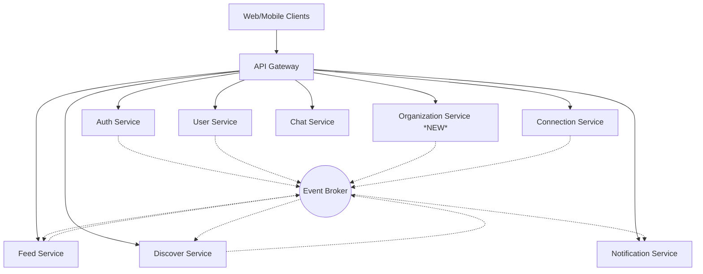
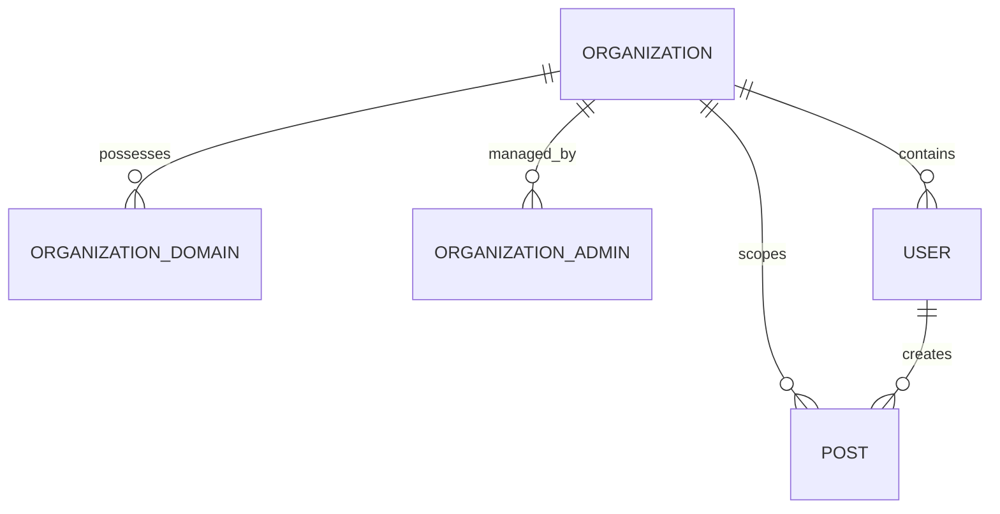

# Campus Connect V2: Network-of-Networks Architecture

## 1. Updated System Architecture

Campus Connect is transitioning from a university-only platform to a Network-of-Networks model. The architecture preserves the Modular Monolith foundation, strictly adhering to bounded contexts to facilitate future microservice extraction.



### Architecture Principles Maintained:
- **REST for Sync:** Client-to-gateway and synchronous inter-module communication.
- **Event-Driven for Async:** Modules emit events (e.g., `UserJoinedOrganization`) to the Event Broker (Kafka/RabbitMQ).
- **Loose Coupling:** Feed and Discover rely on events to build their local read-models/indices, avoiding cross-module database joins.

---

## 2. Organization Service Design

A new `Organization Service` bounded context will manage the lifecycle, settings, and verification of organizational networks.

**Core Responsibilities:**
- Organization Registration & Approval workflows.
- Domain management and validation.
- Organization profiles and settings administration.
- Admin role management for organizations.

**State Machine (Organization Lifecycle):**
`PENDING` $\rightarrow$ `UNDER_REVIEW` $\rightarrow$ (`APPROVED` | `REJECTED`) $\rightarrow$ `ACTIVE`

*Approval is strictly manual by Platform Admins. No automated provisioning without review.*

---

## 3. Database Schema

*Designed for PostgreSQL. Prepared for future SaaS billing extraction.*

### `organizations`
| Column | Type | Constraints | Description |
|--------|------|-------------|-------------|
| `id` | UUID | PK | Unique identifier |
| `name` | VARCHAR | NOT NULL | Org name (e.g., TechCorp) |
| `type` | VARCHAR | NOT NULL | UNIVERSITY, COMPANY, NGO, etc. |
| `description` | TEXT | | Profile description |
| `website` | VARCHAR | | Official URL |
| `official_email` | VARCHAR | NOT NULL | Contact email for verification |
| `location` | VARCHAR | | City, Country, or Remote |
| `logo_url` | VARCHAR | | Cloud storage URL |
| `banner_url` | VARCHAR | | Cloud storage URL |
| `expected_users` | INT | | Scaling metric estimate |
| `status` | VARCHAR | NOT NULL | PENDING, ACTIVE, etc. |
| `created_at` | TIMESTAMP | | |
| `updated_at` | TIMESTAMP | | |
| `billing_customer_id`| VARCHAR | NULL | *Future: Stripe/Braintree ID* |
| `billing_tier` | VARCHAR | NULL | *Future: FREE, PRO, ENTERPRISE* |

### `organization_domains`
| Column | Type | Constraints | Description |
|--------|------|-------------|-------------|
| `id` | UUID | PK | |
| `organization_id` | UUID | FK -> organizations | |
| `domain` | VARCHAR | NOT NULL, UNIQUE | e.g., 'students.abc.edu' |
| `added_at` | TIMESTAMP | | |

### `organization_admins`
| Column | Type | Constraints | Description |
|--------|------|-------------|-------------|
| `organization_id` | UUID | PK, FK -> organizations | |
| `user_id` | UUID | PK, FK -> users | |
| `role` | VARCHAR | NOT NULL | OWNER, ADMIN, MODERATOR |
| `assigned_at` | TIMESTAMP | | |

### `users` (Extended)
| Column | Type | Constraints | Description |
|--------|------|-------------|-------------|
| `organization_id` | UUID | FK -> organizations, NULL | Null for independent users |
| `organization_role`| VARCHAR | NULL | MEMBER, ADMIN |
| `joined_org_at` | TIMESTAMP | NULL | |

### `posts` (Extended)
| Column | Type | Constraints | Description |
|--------|------|-------------|-------------|
| `visibility` | VARCHAR | NOT NULL | PUBLIC, ORGANIZATION_ONLY, FOLLOWERS_ONLY |
| `organization_id` | UUID | FK -> organizations, NULL | Scopes the post if Org-only |

### Indexes & Partitioning:
- **Indexes:** `idx_users_email_domain`, `idx_posts_org_id_visibility`, `idx_org_domains_domain`.
- **Partitioning:** `posts` table should be partitioned by `created_at` (monthly) and optionally hash-partitioned by `organization_id` for extremely large organizations.

---

## 4. Entity Relationships



---

## 5. API Specifications

### Organization Service
- `POST /api/v1/organizations/register` - Submit registration (returns PENDING).
- `PUT /api/v1/platform-admin/organizations/{id}/status` - Approve/Reject (Platform Admin only).
- `GET /api/v1/organizations/{id}` - Public org profile.
- `PUT /api/v1/organizations/{id}` - Update profile (Org Admin only).
- `POST /api/v1/organizations/{id}/domains` - Add a domain (Org Admin only).

### User / Auth Service
- *Registration automatically parses the email domain, queries `organization_domains`, and sets `organization_id` if a match is `ACTIVE`.*

### Feed Service
- `GET /api/v1/feed` - Returns personalized feed. Query parameters no longer dictate scope; backend logic detects if the requesting user belongs to an organization.
- `GET /api/v1/feed/trending` - Returns global trending.
- `GET /api/v1/organizations/{id}/trending` - Returns org-specific trending.

---

## 6. Feed Architecture Changes

The Feed Service evolves to handle multi-scoped feeds dynamically.

**Feed Composition Strategy (Read-Model):**
- **Members (Org Users):** 70% Org Content, 20% Following, 10% Global Discovery.
- **Independent Users:** 70% Global Feed, 20% Following, 10% Viral Org Content.

**Implementation:**
The Feed Service listens to `PostCreated` events. 
- If `visibility == ORGANIZATION_ONLY`, it's added *only* to that Organization's timeline cache.
- Fan-out to followers occurs normally.
- Fan-out to Organization timelines avoids user-by-user fan-out; instead, it uses a hybrid approach: User timeline pulls from `FollowingCache` + `OrganizationTimelineCache` at read-time.

---

## 7. Discover Architecture Changes

Discover Service maintains Elasticsearch/OpenSearch indices.

**Changes:**
1. **New Index:** `organizations_index` populated via `OrganizationActivated` and `OrganizationUpdated` events.
2. **Search API:** Unified search now returns People, Organizations, and Posts.
3. **Trending Topics:** Derived asynchronously from streaming analytics (e.g., Flink/Spark or Redis sorted sets based on engagement events). Emits `TrendingTopicIdentified` events per scope (Global vs Org).

---

## 8. Notification Changes

Notification Service will subscribe to new topics on the Event Broker.

**New Notification Templates:**
- `OrganizationApproved`: Email to the registering user.
- `OrganizationActivated`: Platform-wide setup complete.
- `UserJoinedOrganization`: Sent to Org Admins (optional/batch).
- `PostPromotedToGlobal`: Sent to the author when their org-scoped post breaks out.

---

## 9. Event Definitions (EDA)

```json
// OrganizationActivated
{
  "eventId": "uuid",
  "eventType": "OrganizationActivated",
  "timestamp": "2026-06-14T12:00:00Z",
  "data": {
    "organizationId": "uuid",
    "name": "ABC University",
    "domains": ["abc.edu", "students.abc.edu"]
  }
}

// PostPromotedToGlobal
{
  "eventId": "uuid",
  "eventType": "PostPromotedToGlobal",
  "timestamp": "2026-06-14T12:05:00Z",
  "data": {
    "postId": "uuid",
    "originalOrganizationId": "uuid",
    "authorId": "uuid",
    "engagementScore": 98.5
  }
}
```

---

## 10. Security Design

**RBAC Hierarchy:**
1. `PLATFORM_ADMIN`: Global god-mode (Approvals, Global bans).
2. `ORGANIZATION_ADMIN`: Scoped to `organization_id` (Manage settings, Moderate org-posts, Remove users from org).
3. `USER`: Standard access.

**Data Segregation:**
- Middleware `AuthContext` injects `organizationId` into requests.
- Database policies / ORM scoping must append `WHERE organization_id = ?` for Org Admins fetching data.
- Domain Verification: Email verification via OTP/Magic Link is mandatory to prevent domain spoofing.

---

## 11. Scalability Strategy

- **100k+ Concurrent Users:** 
  - Feed pulls are high-volume. The hybrid fan-out model ensures we don't write 50,000 timeline entries when a large org user posts. We write to ONE org timeline, and reads aggregate it.
- **Organization Isolation:**
  - If a specific organization grows massive (e.g., 500k users), their `organizationId` can be used as a Shard Key in the Feed and Post databases.
- **Trending Calculations:**
  - Count-Min Sketch or Redis Sorted Sets to count hashtags/keywords per hour, partitioned by `organizationId`. 
  - Global Promoted posts cross over when their Z-score anomaly detection flags high velocity.

---

## 12. Migration Plan

1. **Schema Migration:** Deploy ADD COLUMN migrations for `users` and `posts`. These are nullable and safe.
2. **Deploy Organization Service:** Isolated deployment.
3. **Data Backfill:** Migrate existing university entities (if hardcoded) into the new `organizations` table.
4. **Update Auth Flow:** Deploy updated registration logic to assign `organizationId` based on email domain matches.
5. **Feed Cutover:** Deploy updated Feed composition logic. Existing posts default to `visibility = PUBLIC`.

---

## 13. Future Payment Integration Preparation

- Designed with decoupling in mind. The `Organization Service` holds stub fields (`billing_customer_id`, `billing_tier`).
- When billing is implemented, a dedicated `Billing Service` will be introduced. It will map `organization_id` to payment statuses.
- Missing payment events (`SubscriptionFailed`) will simply listen to the Event Bus and downgrade the `Organization Service` state, requiring zero tight coupling.

---

## 14. Recommended Implementation Order

1. **Phase 1: Foundation (DB & Core Models)**
   - Update User and Post schemas.
   - Setup Organization Service skeleton & DB.
2. **Phase 2: Organization Lifecycle**
   - Implement Organization Registration API.
   - Implement Platform Admin Approval API.
   - Implement Domain mapping logic.
3. **Phase 3: User Onboarding**
   - Update Registration flow to parse emails and auto-join Organizations.
4. **Phase 4: Content & Visibility**
   - Update Post creation to accept visibility rules.
   - Implement Feed Service composition logic (70/20/10 split).
5. **Phase 5: Discovery & Trending**
   - Integrate Org data into Discover Service.
   - Implement Cross-Organization Virality (`PostPromotedToGlobal`).
6. **Phase 6: Admin & Polish**
   - Build Org Admin settings and moderation tools.
   - Connect Notification Service events.
